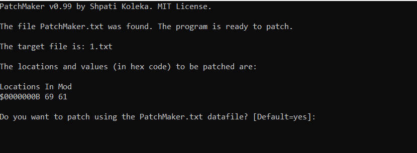

# PatchMaker

Makes and runs patches using text files as input/output. 
This way the user is in control on the exact changes that are being made to the patched file, making patching essentially open source. Works on any kind of file, including large ones, as long as the files have the same size. 

The program is made in Delphi 7. 

 
